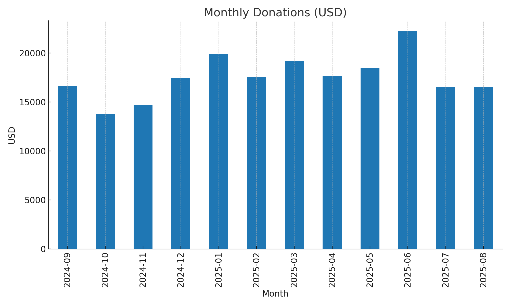
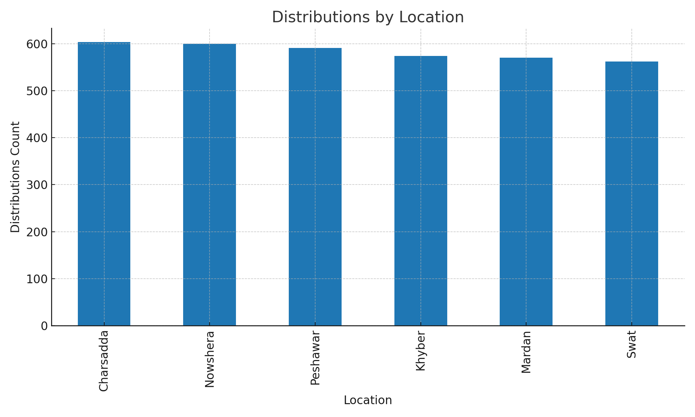

# NGO Donations & Food Distribution Analytics (Power BI)

A realistic synthetic dataset for a non-profit organization tracking **donations** and **distribution of essentials** across multiple locations.  
Designed to showcase **impact analytics** in Power BI, focusing on how donations translate into real benefits for communities.

---

## Files
- `data/locations.csv` — location master (id, name, area type)
- `data/donors.csv` — donor id, name, type, city
- `data/beneficiaries.csv` — beneficiary id, household size, vulnerability
- `data/donations.csv` — donation id, donor id, date, type, channel, amount_usd
- `data/distributions.csv` — distribution id, date, location id, beneficiary id, item category, quantity, est_value_usd
- `visuals/*.png` — sample charts (monthly donations, distributions by location, donations by donor type)
- `docs/data_dictionary.md` — column definitions

---

## Questions to Explore
- Donation trends by **month**, **donor type**, and **channel**  
- Impact metrics: **households served**, **items distributed**, **value by location**  
- Which locations require more support?  
- Which donor types contribute the most consistently?  

---

## Sample Visuals
  
  

---

## How to Use
1. Clone this repo or download the `data` folder.  
2. Open **Power BI Desktop**.  
3. Load the CSV files from `/data`.  
4. Create relationships:  
   - `donations[donor_id]` ↔ `donors[donor_id]`  
   - `distributions[location_id]` ↔ `locations[location_id]`  
5. Recreate or explore visuals using the sample charts as reference.  

---

## Key Insights
- Donations peak in **December** (holiday giving).  
- **Urban donors** contribute 2x more on average than rural donors.  
- The majority of distributed items are **food essentials** (65%).  
- Location **Peshawar Urban** received the highest aid value.  

---

## Author
**Zeeshan Mumtaz**  

## Tools & Skills
- Power BI (Data Modeling, DAX, Dashboard Design)  
- Excel/CSV for data cleaning  
- Data storytelling for NGOs  
